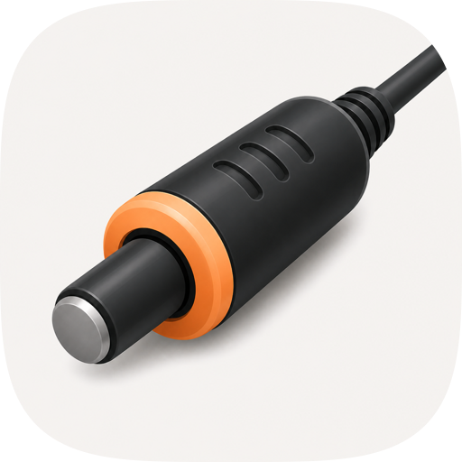
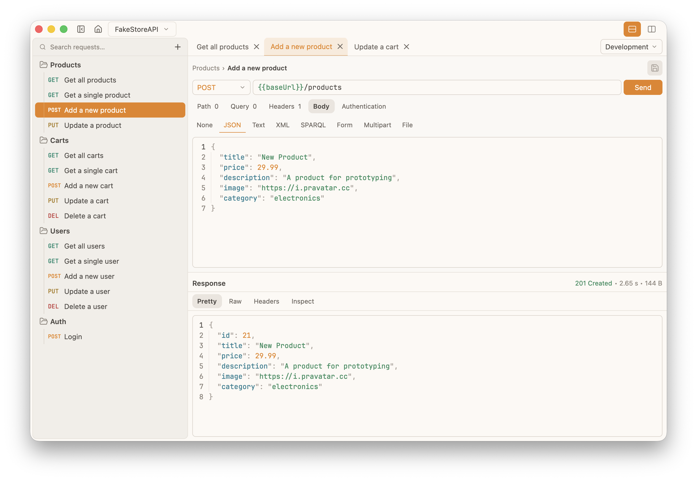

# Probe



A fast, native, local-first API client for macOS, Windows, and Linux.

Built with Rust, GPUI, and Longbridge gpui-base, with OpenCollection YAML as the
primary workspace format.



The project provides two first-class interfaces:

- CLI — for developers, automation, CI, and AI agents
- Desktop — a native GPUI application for interactive API development

Both interfaces use the same Rust application and domain layers.

## Goals

- Fast native desktop experience
- Powerful agent-friendly CLI
- OpenCollection YAML as the primary workspace format
- Filesystem-first and Git-friendly
- No account or cloud service required
- Instant navigation in very large collections
- Compatible with existing OpenCollection collections
- Low memory usage
- Fast startup
- Native GPU-rendered desktop UI without Electron or WebView
- Automation-friendly and suitable for AI coding agents

## Technology

- Rust
- GPUI
- Longbridge [gpui-base](https://longbridge.github.io/gpui-component/base/)
- OpenCollection YAML
- Git-compatible filesystem storage

GPUI provides the native application and rendering framework.

Probe uses Longbridge `gpui-base` (`crates/base` in
[`longbridge/gpui-component`](https://github.com/longbridge/gpui-component))
for interaction, focus, accessibility, and default chrome tokens. That crate
is not `gpui-component` (Longbridge's pre-styled façade).

Desktop chrome uses Probe's Porcelain Honey light theme and Graphite Honey dark
theme through Probe's semantic theme. Domain colors (HTTP methods, status,
syntax) stay distinct.

## Interfaces

### CLI

The CLI is a first-class product interface intended for:

- AI coding agents
- shell scripts
- CI/CD
- automated testing
- developers
- debugging
- headless environments

It supports human-readable and deterministic JSON output.

Examples:

```bash
probe collection validate ./api

cat collection.yml | probe collection validate - --json

probe request list ./api --json

probe request get ./api users/list-users.yml --json

probe request get ./api users/list-users.yml \
  --environment development --json
```

Unbundled collections use workspace-relative request paths as selectors. Bundled
collections use structural selectors:

```bash
probe request get ./collection.yml items/0/items/0 --json
```

```bash
probe request run ./api users/list-users.yml \
  --environment development --json

probe request run ./api reports/download.yml \
  --environment development --output ./report.pdf --json

probe request set ./api users/list-users.yml \
  --method GET --url https://api.example.com/v2/users --json

probe environment set ./api --environment development \
  --name baseUrl --value https://dev.example.com --json

probe environment unset ./api --environment development --name host --json

probe folder create ./api --name Admin --index 0 --json

probe request create ./api --parent admin --name "List admins" \
  --method GET --url https://api.example.com/admins --json

probe request move ./api list-admins.yml --parent admin --index 0 --json

probe folder rename ./api admin --name Administration --json

probe collection validate ./api --quiet

probe collection import postman ./postman-collection.json ./imported.yml --json

probe collection import yaak ./yaak-export.json ./imported.yml --json

probe collection import yaak ./yaak-sync ./imported.yml \
  --workspace wk_01 --allow-partial --json
```

`--environment <name>` selects an OpenCollection environment, applies its `extends`
chain, and interpolates request variables before output or execution preflight.
Use `environment set` and `environment unset` to persist variable values on a named
environment.

## Installation

Download the latest version of Probe for your platform from the [GitHub Releases](https://github.com/crizant/probe/releases) page.

### macOS

Download the macOS release and move **Probe.app** to your Applications folder.

Probe is currently distributed without Apple code signing or notarization. Because of this, macOS may prevent the application from opening and show a warning that the developer cannot be verified.

To open Probe:

1. Try to open **Probe.app** normally.
2. Open **System Settings → Privacy & Security**.
3. Scroll down to the Security section and find the message about Probe being blocked.
4. Click **Open Anyway**, then confirm by clicking **Open**.

Alternatively, right-click **Probe.app** in Finder and choose **Open**. Depending on your macOS version, this may allow you to open the application anyway.

> [!NOTE]
> Probe is a free and open-source project. Apple requires a paid Apple Developer Program membership to distribute a properly signed and notarized macOS application. At the moment, I don't plan to pay the recurring developer fee for this free project, so macOS releases are distributed unsigned.
>
> If you prefer not to run an unsigned binary, you can inspect the source code and build Probe yourself.

### Windows

Download the Windows release, extract the archive, and run **Probe.exe**.

Because Probe is currently distributed without a code-signing certificate, Windows may display a Microsoft Defender SmartScreen warning when you launch it for the first time.

If SmartScreen blocks the application:

1. Click **More info** on the warning.
2. Verify that the application is **Probe**.
3. Click **Run anyway**.

Probe does not require installation and can be run directly from the extracted folder.

### Linux

Download the Linux release and extract the archive:

```bash
tar -xzf probe-*.tar.gz
```

If necessary, make the executable runnable:

```bash
chmod +x probe
```

Then launch Probe:

```bash
./probe
```

You can optionally move the executable somewhere on your `PATH`, for example:

```bash
sudo mv probe /usr/local/bin/
```

After that, Probe can be launched from anywhere:

```bash
probe
```

### CLI

Probe also includes a command-line interface.

After downloading the CLI release for your platform, place the `probe` executable somewhere on your `PATH`.

On macOS and Linux, for example:

```bash
chmod +x probe
sudo mv probe /usr/local/bin/
```

Then verify the installation:

```bash
probe --version
```

On Windows, place `probe.exe` in a directory included in your `PATH`, or add its directory to `PATH`.

For CLI usage and available commands, see [docs/CLI.md](docs/CLI.md).


## Development

Install [rustup](https://rustup.rs/) and enter the repository. The checked-in
`rust-toolchain.toml` automatically selects Rust 1.95.0 and installs the `rustfmt`
and `clippy` components. Verify the environment with:

```bash
rustc --version
cargo --version
cargo fmt --check
```

On macOS, desktop builds also require the full Xcode developer tools (not only the
standalone Command Line Tools), because pinned GPUI compiles Metal shaders.

The repository is a Cargo workspace. It currently includes:

- OpenCollection parsing, bundled and unbundled filesystem loading, and an
  indexed in-memory workspace
- shared environment resolution and asynchronous HTTP execution
- a versioned, automation-safe CLI contract
- Postman Collection v2.0/v2.1 and Yaak export/directory-sync import
- a native GPUI desktop shell with semantic light/dark themes

The desktop app supports OpenCollection-backed browsing, request tabs,
resizable editor/response panes, and a title-bar workspace switcher. The
workspace switcher, empty sidebar, and macOS `File > Import` menu expose the
same Postman/Yaak import workflow. Empty workspaces can create a new bundled
collection or open an existing one.

The request editor updates method, URL, query and `:variableName` path
parameters, headers, body, authentication, and environment selection in memory
as the user works. Desktop Send and Cancel actions use the same asynchronous
HTTP engine as the CLI. Completed responses expose status, duration, size,
headers, and body in a Pretty/Raw/Headers viewer with search. Large bodies are
virtualized so navigation stays responsive.

The editor and response viewer support vertical or horizontal layouts. The
local desktop session restores the active workspace, tabs, collapsed folders,
selected environment, pane orientation, and pane sizes automatically.

Edited requests show a dirty indicator and expose a save icon beside the URL
while dirty. Saves use the shared atomic OpenCollection repository on a
background executor, and Probe asks before closing tabs, collections, or the
application with unsaved changes.

Open collections are watched for filesystem changes. Valid external edits,
additions, deletions, and identifiable renames are reconciled in the background.
Conflicting local drafts remain protected until the user chooses which version
to keep.

The desktop collection tree exposes keyboard-accessible controls for creating,
renaming, deleting, moving, and reordering requests and folders. The same move
and reorder operations can be performed by dragging tree rows onto folder or
sibling targets. Structural writes run in the background through the shared
repository, while open tabs, collapsed folders, session selectors, and unsaved
request drafts follow persisted selector remaps.

```bash
cargo run -p probe-cli -- --help
cargo run -p probe-desktop
cargo fmt --check
cargo clippy --all-targets --all-features
cargo test
```

## Releases

Release builds are created by GitHub Actions when a version tag such as `v0.2.0`
is pushed. Use the release helper from a clean worktree:

```bash
scripts/release.sh 0.2.0
```

The script updates the workspace version in `Cargo.toml`, runs the release checks,
commits the version bump, creates an annotated tag, and pushes the branch and tag
to `origin`. The tag then triggers CLI and desktop release artifacts.

Core performance baselines cover parsing, workspace construction, request lookup,
CLI startup, and practical peak-memory profiling at 100, 1,000, and 10,000 requests.
See [docs/PERFORMANCE.md](docs/PERFORMANCE.md) for reproducible commands and fixture
generation.

Desktop work follows the native, platform-aware design and future plain-text theming
contract in [docs/DESIGN.md](docs/DESIGN.md).

Try the current CLI against the included unbundled fixture:

```bash
cargo run -p probe-cli -- collection validate \
  tests/fixtures/opencollection/unbundled --json

cargo run -p probe-cli -- request list \
  tests/fixtures/opencollection/unbundled --json

cargo run -p probe-cli -- request get \
  tests/fixtures/opencollection/unbundled users/list-users.yml --json

cargo run -p probe-cli -- request get \
  tests/fixtures/opencollection/phase4-environments.yml items/0 \
  --environment development --json
```

See [docs/CLI.md](docs/CLI.md) for selectors, JSON fields, and exit codes.
