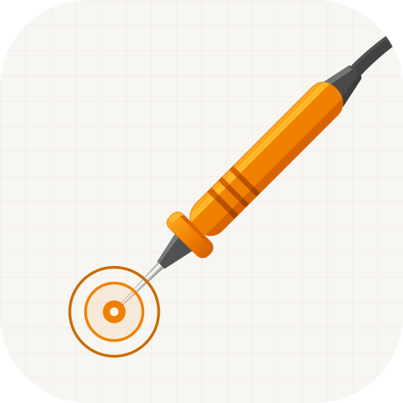
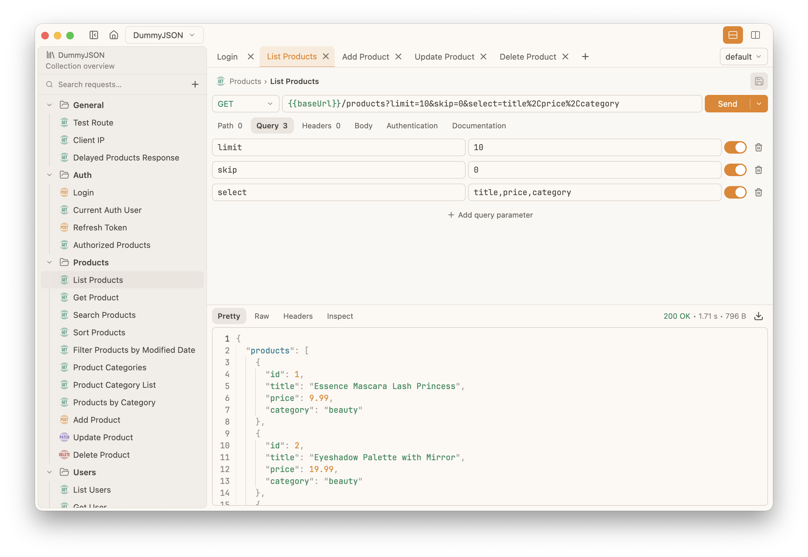

# Probe

[](https://github.com/crizant/probe/releases/latest)
[](https://github.com/crizant/probe/actions/workflows/ci.yml)
[](https://github.com/crizant/probe)
[](LICENSE)



A fast, native, local-first API client for macOS, Windows, and Linux.

Built with Rust, GPUI, and Longbridge gpui-base, with OpenCollection YAML as the
primary workspace format.

The project provides two first-class interfaces:

- CLI — for developers, automation, CI, and AI agents
- Desktop — a native GPUI application for interactive API development

Both interfaces use the same Rust application and domain layers.




## Goals

- Fast native desktop experience
- Powerful agent-friendly CLI
- OpenCollection YAML as the primary workspace format
- Filesystem-first and Git-friendly
- No account or cloud service required
- Instant navigation in very large collections
- Compatible with existing OpenCollection collections
- Low memory usage
- Fast startup
- Native GPU-rendered desktop UI without Electron or WebView
- Automation-friendly and suitable for AI coding agents

## Feature support

| Feature | Desktop | CLI |
| --- | --- | --- |
| HTTP requests and response inspection | Yes | Yes |
| GraphQL over HTTP (GET/POST) | Yes | Yes |
| OpenCollection YAML (bundled files and directories) | Read and edit | Read, validate, and edit |
| Environments, inheritance, and `{{variables}}` | Yes | Yes; runtime `--var` overrides |
| Secret variables | OS credential store | Process environment (`--secret-provider env`) |
| Basic, Bearer, and API Key authentication | Yes | Yes |
| Postman and Yaak imports | Yes | Yes |
| Request and folder organization | Yes | Yes |
| Dry runs, status assertions, and versioned JSON | — | `--dry-run`, `--expect`, `--json` |

OAuth and AWS Signature authentication can be retained in YAML but are not executed.
See [the CLI reference](docs/CLI.md) for command details and import limitations.

## Installation

Download the latest version of Probe for your platform from the [GitHub Releases](https://github.com/crizant/probe/releases) page.

### macOS

Download the macOS release and move **Probe.app** to your Applications folder.

Probe is currently distributed without Apple code signing or notarization. Because of this, macOS may prevent the application from opening and show a warning that the developer cannot be verified.

To open Probe:

1. Try to open **Probe.app** normally.
2. Open **System Settings → Privacy & Security**.
3. Scroll down to the Security section and find the message about Probe being blocked.
4. Click **Open Anyway**, then confirm by clicking **Open**.

Alternatively, right-click **Probe.app** in Finder and choose **Open**. Depending on your macOS version, this may allow you to open the application anyway.

> [!NOTE]
> Probe is a free and open-source project. Apple requires a paid Apple Developer Program membership to distribute a properly signed and notarized macOS application. At the moment, I don't plan to pay the recurring developer fee for this free project, so macOS releases are distributed unsigned.
>
> If you prefer not to run an unsigned binary, you can inspect the source code and build Probe yourself.

### Windows

Download the Windows release, extract the archive, and run **Probe.exe**.

Because Probe is currently distributed without a code-signing certificate, Windows may display a Microsoft Defender SmartScreen warning when you launch it for the first time.

If SmartScreen blocks the application:

1. Click **More info** on the warning.
2. Verify that the application is **Probe**.
3. Click **Run anyway**.

Probe does not require installation and can be run directly from the extracted folder.

### Linux

Download the Linux release and extract the archive:

```bash
tar -xzf probe-*.tar.gz
```

If necessary, make the executable runnable:

```bash
chmod +x probe
```

Then launch Probe:

```bash
./probe
```

You can optionally move the executable somewhere on your `PATH`, for example:

```bash
sudo mv probe /usr/local/bin/
```

After that, Probe can be launched from anywhere:

```bash
probe
```

### CLI

Probe also includes a command-line interface.

After downloading the CLI release for your platform, place the `probe` executable somewhere on your `PATH`.

On macOS and Linux, for example:

```bash
chmod +x probe
sudo mv probe /usr/local/bin/
```

Then verify the installation:

```bash
probe --version
```

On Windows, place `probe.exe` in a directory included in your `PATH`, or add its directory to `PATH`.

## Getting started

In Desktop, choose **Open Collection…** to open an OpenCollection YAML file or
collection directory, select a request, and send it. Choose an environment when
requests use variables.

### CLI

The CLI is a first-class, non-interactive interface for developers, AI agents,
shell automation, CI, testing, debugging, and headless environments. It supports
human-readable output and deterministic, versioned JSON.

```bash
probe collection validate ./api

cat collection.yml | probe collection validate - --json

probe request list ./api --json

probe request run ./api users/list-users.yml \
  --environment development --json

probe collection import postman ./postman-collection.json ./imported.yml --json
```

See [docs/CLI.md](docs/CLI.md) for the complete command surface, selectors, JSON
schemas, and exit codes.

## Technology

- Rust
- GPUI
- Longbridge [gpui-base](https://longbridge.github.io/gpui-component/base/)
- OpenCollection YAML
- Git-compatible filesystem storage

GPUI provides the native application and rendering framework.

Probe uses Longbridge `gpui-base` (`crates/base` in
[`longbridge/gpui-component`](https://github.com/longbridge/gpui-component))
for interaction, focus, accessibility, and default chrome tokens. That crate
is not `gpui-component` (Longbridge's pre-styled façade).

Desktop chrome uses Probe's Porcelain Honey light theme and Graphite Honey dark
theme through Probe's semantic theme. Domain colors (HTTP methods, status,
syntax) stay distinct.

## Development

Install [rustup](https://rustup.rs/) and enter the repository. The checked-in
`rust-toolchain.toml` automatically selects Rust 1.95.0 and installs the `rustfmt`
and `clippy` components. Verify the environment with:

```bash
rustc --version
cargo --version
cargo fmt --check
```

On macOS, desktop builds also require the full Xcode developer tools (not only the
standalone Command Line Tools), because pinned GPUI compiles Metal shaders.

The repository is a Cargo workspace. Read [AGENTS.md](AGENTS.md) before changing
code; it routes each task to the relevant reference without requiring the entire
documentation set. Start with the [documentation index](docs/README.md) when
exploring the project.

```bash
cargo run -p probe-cli -- --help
cargo run -p probe-desktop
cargo fmt --check
cargo clippy --all-targets --all-features
cargo test
```

## Releases

Release builds are created by GitHub Actions when a version tag such as `v0.2.0`
is pushed. CI and release validation check compatibility with the declared Rust
1.95 MSRV using Rust 1.95.0. Production CLI and desktop artifacts are built with
explicitly pinned Rust 1.99.0. Use the release helper from a clean worktree:

```bash
scripts/release.sh 0.2.0
```

The script updates the workspace version in `Cargo.toml`, moves unreleased
changelog notes under the new version and Australia/Brisbane date, runs the
release checks, commits those updates, creates an annotated tag, and pushes the
branch and tag to `origin`. The tag then triggers CLI and desktop release artifacts.

Core performance baselines cover parsing, workspace construction, request lookup,
CLI startup, and practical peak-memory profiling at 100, 1,000, and 10,000 requests.
See [docs/PERFORMANCE.md](docs/PERFORMANCE.md) for reproducible commands and fixture
generation.

Desktop work follows the native, platform-aware contract in
[docs/DESIGN.md](docs/DESIGN.md).
